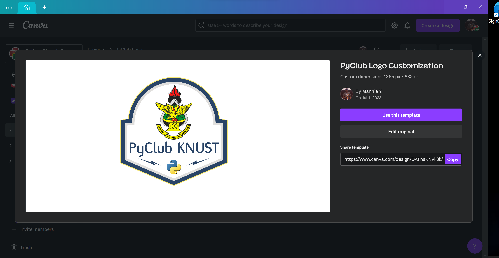

# 🎨 Your Club Logo

Creating a logo for your club under PyClubs can be an exciting way to showcase your group's identity and spirit. Here’s a guide to help you through the process:

## Step 1: Access the Canvas Template

<figure><figcaption>
Canva Template
</figcaption></figure>

We've provided a canvas template that is tailored for creating logos. Begin by accessing this template, which is designed to ensure that your logo meets the size and format requirements set by PyClubs.


Link to PyClub Template


## Step 2: Replace the University Logo

The canvas comes with a placeholder for a university logo. You will need to replace this with your own university’s logo. Make sure the logo you use is in PNG format for transparency and crispness. This will be especially important if the logo is to be used on various backgrounds or printed materials.

<figure><figcaption>
Replace logo with your university logo
</figcaption></figure>

## Step 3: Incorporate the PyClub Initials

Your PyClub’s initials should be integrated into the design of the main logo. Arrange the initials in a way that they are clearly visible and form a cohesive design with the university logo. Be careful not to let the initials extend beyond the bounds of the main logo design.

<figure><figcaption>
Enter university initials
</figcaption></figure>

## Step 4: Adherence to Design Principles

As you design your logo, keep in mind basic design principles such as balance, contrast, and simplicity. Your logo should be recognizable and should look professional. It’s advisable to use a limited color palette and ensure the logo is scalable for different uses.&#x20;

<figure><figcaption>
IMG 1
</figcaption></figure>

 

<figure><figcaption>
IMG 2
</figcaption></figure>

IMG 1: Make sure the \[INITIALS] are not too big\
\
IMG 2: The university logo size shouldn't be too big, and the initials too small

<figure><figcaption>
IMG 3
</figcaption></figure>

 

<figure><figcaption>
IMG 4
</figcaption></figure>

Importantly, the outer colors of your PyClub logo should match your school’s logo colors to maintain visual coherence and brand alignment \[IMG 3 & 4]. This will help in creating a strong association between your club and the university.

## Step 5: Submission for Approval

Once you are satisfied with your design, submit the logo to PyClubs for approval. Email your final design to [team@pyclubs.org](mailto:team@pyclubs.org). The submission should include the original PNG file of the logo.

## Step 6: Await Feedback

After submission, wait for feedback from the PyClubs design team. If there are any changes needed, they will communicate them to you. Make sure to address the feedback promptly to finalize your club’s logo.

## Step 7: Finalize and Use Your Logo

Upon approval, your club’s logo is ready for use. You can start incorporating it into your club’s materials such as banners, club page on the website, merchandise, and more.

Remember, your logo is a representation of your club’s brand, so take the time to make it meaningful and appealing. Good luck with your design!
